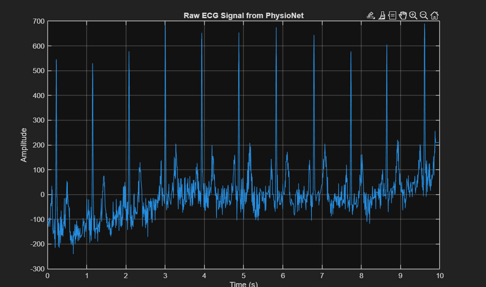
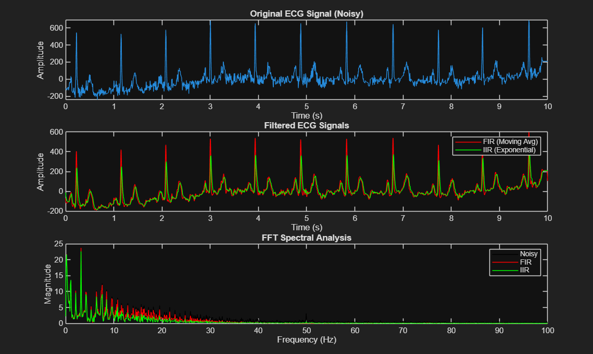
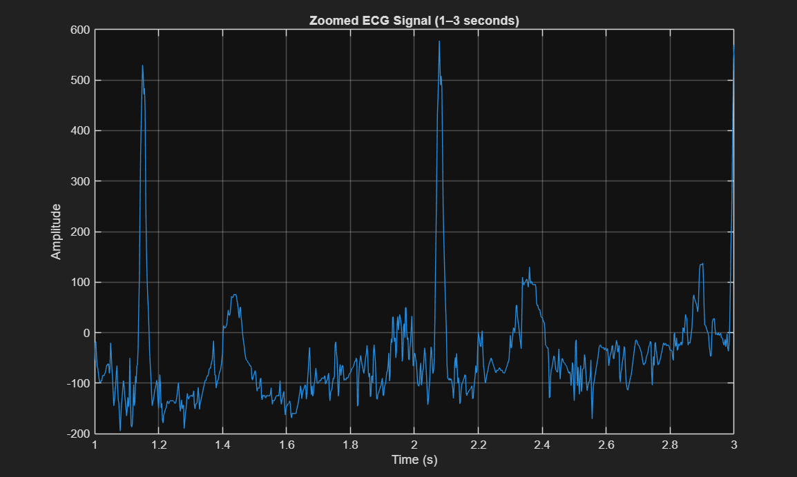

# ECG Noise Reduction Using FIR and IIR Filters (MATLAB)

This project focuses on removing noise from Electrocardiogram (ECG) signals using basic digital signal processing techniques. Finite Impulse Response (FIR) and Infinite Impulse Response (IIR) filters are implemented and their performances are compared. Frequency-domain analysis is also performed using Fast Fourier Transform (FFT).

---

## 📖 Abstract

ECG signals are often corrupted by noise such as power-line interference and baseline wander. This project aims to reduce such noise using digital filtering techniques. A moving average FIR filter and an exponential IIR filter are applied to noisy ECG data, and their effectiveness is evaluated through time-domain plots and FFT spectrum analysis.

---

## 🎯 Objectives

- Read ECG signal from PhysioNet data files  
- Apply FIR Moving Average Filter  
- Apply IIR Exponential Filter  
- Compare filtered outputs  
- Perform FFT analysis  
- Visualize time and frequency domain results  

---

## 🧠 Methodology

1. Read header (.hea) and data (.dat) files  
2. Extract sampling frequency and ECG samples  
3. Select one ECG channel  
4. Apply FIR filter  
5. Apply IIR filter  
6. Compute FFT  
7. Plot and save results  

---

## 🛠 Tools & Technologies

- MATLAB  
- Git Bash  
- GitHub  

---

## 📂 Files in This Repository

- ecg_denoising_project.m  
- 00001_hr.dat  
- 00001_hr.hea  
- raw_ecg.png  
- filtered_fft_results.png  
- zoomed_ecg.png  

---

## ▶ How to Run the Project

1. Open MATLAB  
2. Place all files in the same folder  
3. Run the command:

---

## 📊 Outputs

### 🔹 Raw ECG Signal

### 🔹 Filtered ECG & FFT Analysis

### 🔹 Zoomed ECG Signal

---

## ✅ Results

The FIR filter smooths high-frequency noise, while the IIR filter provides faster response with low computational complexity. Both filters improve ECG signal clarity. FFT analysis confirms noise reduction in higher frequencies.

---

## 📌 Applications

- Biomedical signal processing  
- Heart disease monitoring systems  
- Wearable healthcare devices  
- Medical research  

---

## 🔮 Future Scope

- Add adaptive filters  
- Implement notch filter for power-line noise  
- Real-time ECG processing  
- GUI-based MATLAB application  

 Author

Deepa Vastala
